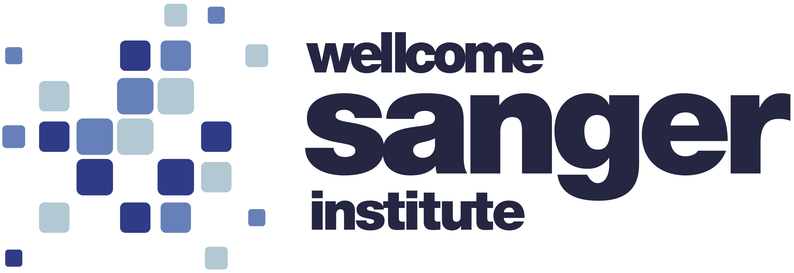

# Biodiversity Cell Atlas web app

The Biodiversity Cell Atlas is a coordinated international effort aimed at molecularly characterizing cell types across the eukaryotic tree of life. Our mission is to pave the way for the efficient expansion of cell atlases to hundreds of species.

## Overview

This project uses:

* [Podman Compose][] to manage multiple [Podman][] containers (using [docker-compose][Docker Compose] backend for compatibility)
* [Django][], a high-level Python web framework setup using [Gunicorn][]
* [PostgreSQL][], a relational database
* [Nginx][], a reverse proxy
* [Ghost][], a blog-focused Content Management System (CMS)

### Initial setup

To set up the project and run the web app locally, first install:
* [Podman][] — consider installing via [Podman Desktop][] to make it easier to manage Podman containers
* [docker-compose (standalone)][docker-compose] — Docker itself is not required

Then, follow these steps:

```bash
# Go to the project directory
cd bca-website

# Copy the .env.template to .env
cp .env.template .env

# Start Podman Compose to locally deploy the web app
# - Prepares, downloads and starts all containers
# - `-d`: starts the containers in detached mode
# - `--build web`: rebuilds the web image if needed (for instance, new Python
#   dependencies in `requirements.txt`)
podman compose up -d --build web

# Create a superuser (only required once for database setup)
podman compose exec web python manage.py createsuperuser
```

### Development

These are some of the commands to use during development:

```bash
# Locally deploy the web app to localhost
podman compose up -d --build web

# Check information about the active Compose containers
podman compose ps

# Check container logs
# - use `-f` to live update log output
# - add container name to print logs only for that container
podman compose logs
podman compose logs -f
podman compose logs web

# Run a bash shell within the web app container
podman compose exec web bash

# Run a Python shell within the context of the web app
# https://docs.djangoproject.com/en/dev/intro/tutorial02/#playing-with-the-api
podman compose exec web python manage.py shell

# Run unit tests: https://docs.djangoproject.com/en/dev/topics/testing/
podman compose exec web python manage.py test

# Stop and delete all containers and Compose-related networks
podman compose down
```

The project directory is automatically mounted to the web app container,
allowing to preview updates in the web app in real-time, except for
static files and Django model updates.

#### Update static files

Static files are served by [Nginx][].

If you need to manually update the static files (such as when editing them),
run the [`collectstatic`][collectstatic] command:

```bash
podman compose exec web python manage.py collectstatic --noinput
```

The `collectstatics` command runs automatically when the web app container starts,
so you can simply run `podman compose restart web`.

#### Update Django models

To apply changes to Django models, run the [`migrate`][migrate] command:

```bash
podman compose exec web python manage.py migrate
```

The `migrate` command runs automatically when the web app container starts in
development mode, so you can simply run `podman compose restart web`.
The automatic command will not work if there is an issue that requires
manual intervention.

### Production

A dedicated Compose file (`such as compose.prod.yml`) can be used for production-specific settings:

``` bash
# Deploy in production mode
# Alternatively, set COMPOSE_FILE in .env: COMPOSE_FILE=compose.yml:compose.prod.yml
podman compose -f compose.yml -f compose.prod.yml up -d
```

## Contact us

[][CRG]

[][EBI]

[][Sanger]

[Podman]: https://podman.io
[Podman Compose]: https://docs.podman.io/en/stable/markdown/podman-compose.1.html
[Podman Desktop]: https://podman-desktop.io
[Docker Compose]: https://docs.docker.com/compose
[docker-compose]: https://docs.docker.com/compose/install/standalone/
[Django]: https://djangoproject.com
[PostgreSQL]: https://postgresql.org
[Nginx]: https://nginx.org
[Gunicorn]: https://gunicorn.org
[Ghost]: https://ghost.org

[collectstatic]: https://docs.djangoproject.com/en/5.2/ref/contrib/staticfiles/#collectstatic
[migrate]: https://docs.djangoproject.com/en/dev/topics/migrations/

[CRG]: https://crg.eu
[EBI]: https://ebi.ac.uk/
[Sanger]: https://sanger.ac.uk/
